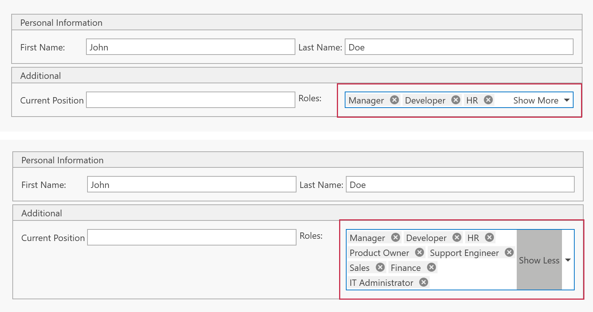

<!-- default badges list -->

[](https://supportcenter.devexpress.com/ticket/details/{SUPPORT_CENTER_TICKET_ID})
[](https://docs.devexpress.com/GeneralInformation/403183)
[](#does-this-example-address-your-development-requirementsobjectives)
<!-- default badges end -->

# WPF ComboBoxEdit — Add a "Show More" Button to Expand/Collapse Selected Tokens

This example attaches a reusable behavior to a [ComboBoxEdit](https://docs.devexpress.com/WPF/DevExpress.Xpf.Editors.ComboBoxEdit) that displays selected items as tokens. When the selected tokens do not fit within the editor's collapsed height, the behavior adds a single **Show More** / **Show Less** toggle button that expands and collapses the editor.



## Overview

The `ComboBoxEdit` uses [CheckedTokenComboBoxStyleSettings](https://docs.devexpress.com/WPF/DevExpress.Xpf.Editors.CheckedTokenComboBoxStyleSettings) to render selected values as wrapping tokens. A large selection either grows the editor or forces the user to scroll. The `ShowMoreBehavior` keeps the editor at a fixed collapsed height and exposes a toggle button so users can expand it on demand.

The behavior is self-contained and MVVM-friendly. You can attach it to any token-based `ComboBoxEdit` and set `CollapsedHeight`:

```xml
<dxe:ComboBoxEdit ItemsSource="{Binding AvailableRoles}"
                  EditValue="{Binding CurrentEmployee.RoleIds}"
                  DisplayMember="Name" ValueMember="Id">
    <dxmvvm:Interaction.Behaviors>
        <local:ShowMoreBehavior CollapsedHeight="22"/>
    </dxmvvm:Interaction.Behaviors>
</dxe:ComboBoxEdit>
```

## Implementation Details

The core logic is stored in [ShowMoreBehavior.cs](./ShowMoreBehavior.cs), a `Behavior<ComboBoxEdit>`:

- **Token style** — applies `CheckedTokenComboBoxStyleSettings` with `EnableTokenWrapping = true` so selected values render as tokens that wrap to multiple lines.
- **Show More / Show Less button** — a single toggle [ButtonInfo](https://docs.devexpress.com/WPF/DevExpress.Xpf.Editors.ButtonInfo) is added to `ComboBoxEdit.Buttons`. Clicking it runs `ToggleExpandCollapseCommand`, which flips the `IsExpanded` property. The caption is bound to `ShowMoreButtonText` and updates to "Show More" or "Show Less" to reflect the current state.
- **Collapse/Expand** — the `IsExpanded` property switches `ComboBoxEdit.MaxHeight` between `CollapsedHeight` (default `22`) and `double.PositiveInfinity`, so the editor grows to reveal all tokens and shrinks back.
- **Button visibility** — the behavior binds to the inner `ScrollViewer.ScrollableHeight` and displays the button only when the tokens overflow the collapsed height (`ScrollableHeight > 0`) or while the editor is expanded.

### Files to Review

- [ShowMoreBehavior.cs](./ShowMoreBehavior.cs)
- [MainWindow.xaml](./MainWindow.xaml)
- [MainViewModel.cs](./MainViewModel.cs)
- [Employee.cs](./Employee.cs)
- [EmployeeRole.cs](./EmployeeRole.cs)

## Documentation

- [ComboBoxEdit](https://docs.devexpress.com/WPF/DevExpress.Xpf.Editors.ComboBoxEdit)
- [ComboBoxEdit Operation Modes (Token / Checked Token)](https://docs.devexpress.com/WPF/116528/controls-and-libraries/data-editors/common-features/editor-operation-modes/comboboxedit#checked-token-combobox)
- [CheckedTokenComboBoxStyleSettings](https://docs.devexpress.com/WPF/DevExpress.Xpf.Editors.CheckedTokenComboBoxStyleSettings)
- [ButtonInfo](https://docs.devexpress.com/WPF/DevExpress.Xpf.Editors.ButtonInfo)
- [Behaviors (DevExpress MVVM)](https://docs.devexpress.com/WPF/17442/mvvm-framework/behaviors)

## Does This Example Address Your Development Requirements/Objectives?

[](https://www.devexpress.com/support/examples/survey.xml?utm_source=github&utm_campaign=wpf-support-showmore-button-in-comboboxedit-with-tokens&~~~was_helpful=yes) [](https://www.devexpress.com/support/examples/survey.xml?utm_source=github&utm_campaign=wpf-support-showmore-button-in-comboboxedit-with-tokens&~~~was_helpful=no)

(you will be redirected to DevExpress.com to submit your response)
